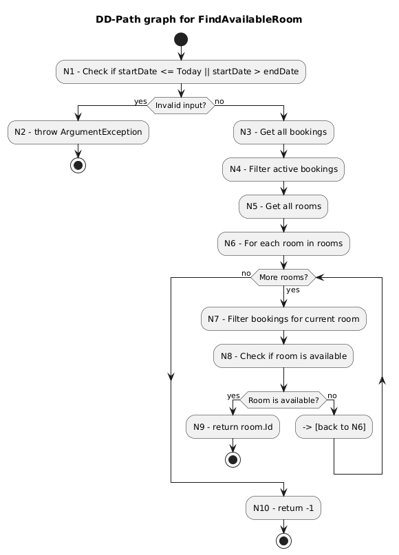

# HotelBooking_Clean_Async
Async version of HotelBooking_Clean



---

## Node Coverage
**Goal:** Visit every node (N1–N10) at least once.

### Test Cases:
- **TC1:** Valid dates, room is available immediately  
  ➤ Covers nodes: N1, N3–N9
- **TC2:** Valid dates, no room is available  
  ➤ Covers nodes: N1, N3–N10
- **TC3:** Invalid dates (e.g., startDate <= Today)  
  ➤ Covers nodes: N1–N2
- **TC4:** No rooms in system  
  ➤ Skips loop (covers N1, N3–N5, N10)
- **TC5:** Room available after several iterations  
  ➤ Covers full loop (N1, N3–N9 after >1 loop cycles)

---

## Edge Coverage
**Goal:** Traverse every edge in the control flow.

### Test Cases:
- **TC1:** Valid input, first room is available → exits early
- **TC2:** Valid input, all rooms unavailable → loop ends → return -1
- **TC3:** Invalid input → N1 to N2 edge (throws exception)
- **TC4:** No rooms in system → skips loop
- **TC5:** Room available after multiple iterations

---

## Loop Coverage
**Goal:** Test loop with 0, 1, and >1 iterations.

### Test Cases:
- **TC1:** 1 iteration — first room is available → return room.Id
- **TC2:** >1 iterations — 3rd room is available → tests full loop
- **TC4:** 0 iterations — no rooms → loop skipped → return -1

---

## Unified Test Case Table

| Test Case | Description | Coverage | Expected Result |
|-----------|-------------|----------|-----------------|
| **TC1** | Valid input, room available immediately | Node, Edge, Loop (1) | `room.Id` |
| **TC2** | Valid input, all rooms unavailable | Node, Edge, Loop (>1) | `-1` |
| **TC3** | Invalid input (start in past or after end) | Node, Edge | Exception |
| **TC4** | No rooms in system | Node, Edge, Loop (0) | `-1` |
| **TC5** | Room available after several iterations | Node, Edge, Loop (>1) | `room.Id` |

## Cyclomatic Complexity
``` V(G) = E - N + 2P```   
Graph-based formula.  

V(G) = Cyclomatic Complexity 
E = Number of edges = 10  
N = Number of nodes = 10  
P = Number of connected components = 1  
  
````V(G) = 10 - 10 + 2*1 = 2 ````  

Cyclomatic Complexity = 2.

## Alternate CC formula
```V(G) = number of decision + 1```  
Decision-Point Method   

3x Decisions in FindAvailableRoom namely   
``2x if statements and 1x foreach``   
``V(G) = 3 + 1 = 4`` 

Cyclomatic Complexity = 4.

---

## Conclusion

The `FindAvailableRoom` method was analyzed using multiple white-box techniques.  
All test cases are derived to ensure complete node, edge, and loop coverage.  
Cyclomatic complexity was calculated using both the graph-based and decision-point methods,  
resulting in **V(G) = 2** and **V(G) = 4** respectively, depending on the approach.

This ensures strong confidence in the quality and testability of the method.